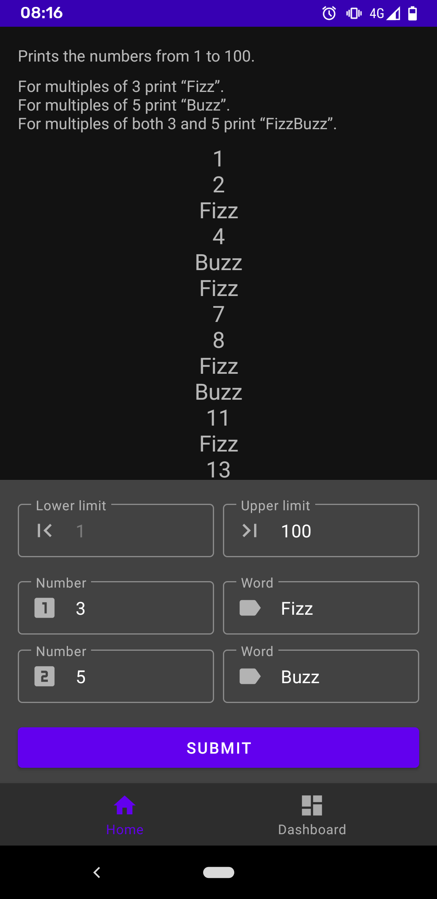
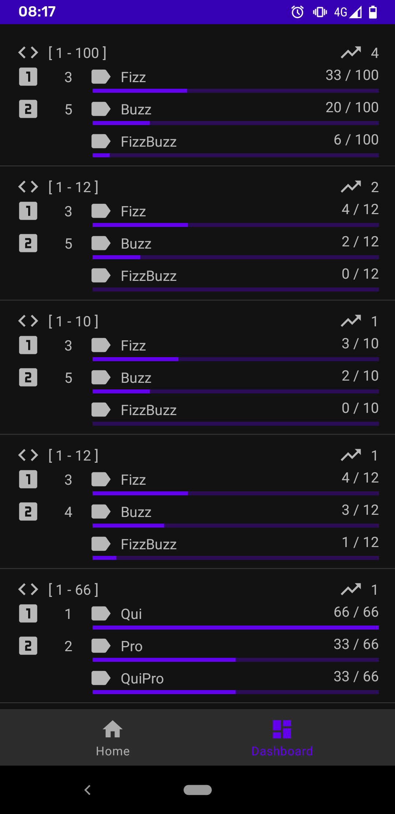

# FizzBuzz Android Application

HomeFragment displays several input fields. Pre-filled values can be edited and submitted to change the fizz-buzz text.

DashboardFragment displays all fizz-buzz requests. They are ordered by descending request count.

| HomeFragment | DashboardFragment |
| - | - |
|  |  |
